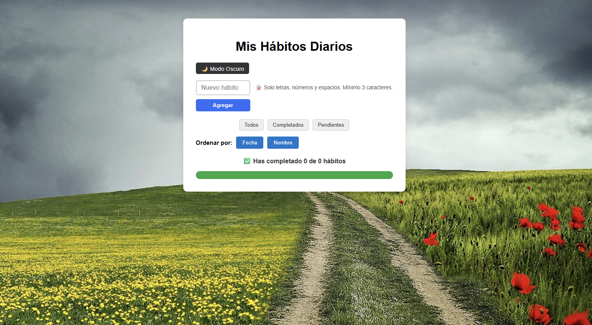

# 🌟 EVALUACION_REACT – App de Hábitos Diarios

Esta es una aplicación web desarrollada con **React** + **Vite** que permite registrar, organizar y visualizar hábitos diarios.  
Cuenta con **modo claro y oscuro**, animaciones suaves, filtros por estado, ordenamiento, progreso visual y un **calendario mensual** donde se reflejan los hábitos realizados cada día.

> 🧪 Proyecto realizado como parte de una evaluación educativa.

---

## ✨ Características principales

- ✅ Agregar y eliminar hábitos
- 🌓 Alternar entre modo claro y oscuro
- 🔄 Animaciones al agregar o eliminar hábitos
- 🔍 Filtros: Todos | Completados | Pendientes
- 📅 Muestra la fecha del hábito
- 📊 Barra de progreso visual
- ✅ **Validaciones** al ingresar hábitos

---

## ✅ Validaciones implementadas

- No permite agregar hábitos vacíos
- No permite ingresar nombres duplicados
- Requiere al menos 3 caracteres y como máximo 50
- El texto debe contener al menos una letra (no solo símbolos o números)

---

## 🚀 Vista previa

 

---

## 🛠️ Tecnologías utilizadas

| Herramienta       | Versión       |
|-------------------|---------------|
| Node.js           | v22.16.0      |
| npm               | 10.9.2        |
| React             | 19.1.0        |
| React DOM         | 19.1.0        |
| Vite              | 7.0.2         |
| gh-pages          | 6.3.0         |
| ESLint            | 9.30.1        |

---

## ⚙️ Configuración adicional

Para poder ejecutar correctamente algunos comandos en Windows (como `npm run deploy`), fue necesario conceder permisos administrativos al terminal de Visual Studio Code. También se verificó la instalación global de `gh-pages`. Para resolverlo, se utilizó:

Set-ExecutionPolicy -Scope CurrentUser -ExecutionPolicy RemoteSigned

Esto permitió correr correctamente scripts como npm run build y npm run deploy.

---

## 📦 Instalación y ejecución

1. Clona el repositorio:
   
   git clone https://github.com/tu-usuario/EVALUACION_REACT.git
   cd EVALUACION_REACT

Instala las dependencias:

    npm install

Ejecuta en modo desarrollo:

    npm run dev

---

🚀 Scripts disponibles

npm run dev         # Inicia el servidor de desarrollo
npm run build       # Genera la versión de producción (carpeta dist)
npm run preview     # Previsualiza la build local
npm run deploy      # Publica en GitHub Pages
📦 El proyecto está configurado para desplegarse en GitHub Pages desde la carpeta dist/.

---

✨ Créditos
Desarrollado por Carol marcel como parte de un desafío académico.
Incluye funcionalidades mejoradas y diseño visual intuitivo.

Carol Marcel - Evaluación de React - Año 2025

¡Gracias por visitar este proyecto! ✨

---

